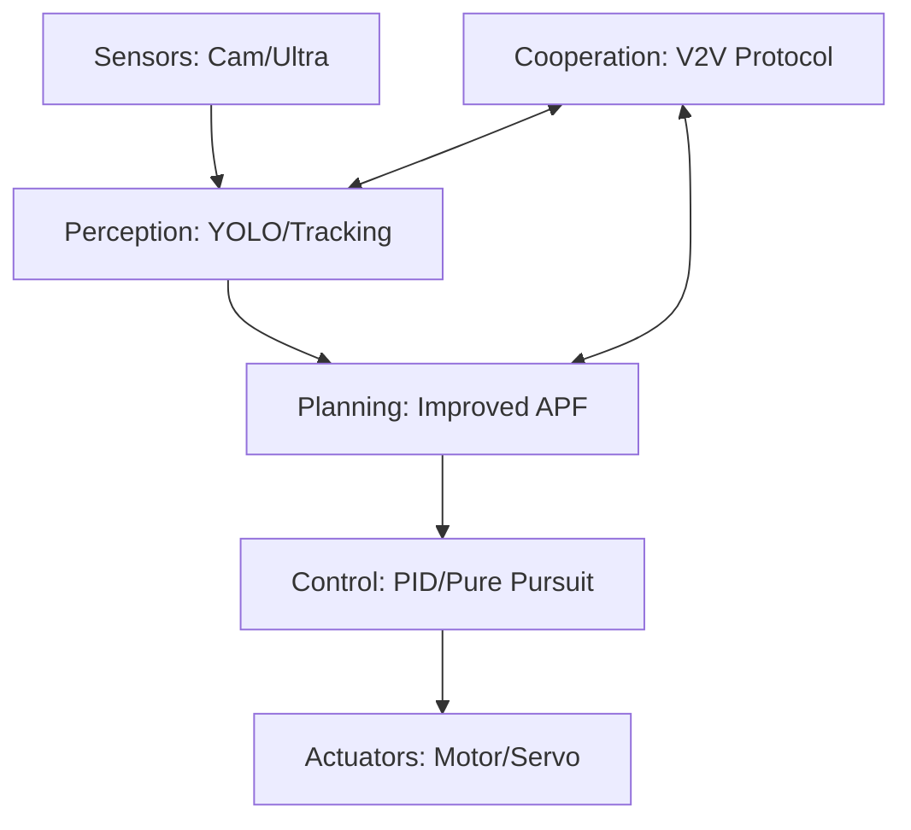

<div align="center">

# 🚗 NexusPilot

**Cooperative Autonomous Driving with V2V Communication**

*Interconnected Hub (Nexus) · Autonomous Navigation (Pilot)*

[](https://python.org)
[](https://carla.org)
[](https://ultralytics.com)
[](#-how-to-run)

</div>

---

NexusPilot is an integrated autonomous driving system that combines **AI-based vision perception**, **Improved Artificial Potential Field (APF) planning**, and **decentralized V2V cooperative logic**. The system has been rigorously validated on both the CARLA 0.9.13 simulator and a physical Raspberry Pi 5 4WD platform.

## 🏆 Final Performance Metrics

| Metric | Simulation (CARLA) | Hardware (RPi 5) | Status |
|--------|-------------------|------------------|--------|
| **Success Rate (OASR)** | **90.4%** (250 trials) | **75.0%** (20 trials) | ✅ Validated |
| **Pipeline Throughput** | 19.3 FPS | **12.7 FPS** | ✅ Real-time |
| **V2V Cooperative Gain**| **45.0%** collision reduction | Verified (2-car) | ✅ Proven |
| **Local Minima Escape** | 85.7% Success | Integrated | ✅ Robust |

## ✨ Core Innovations

- 🎯 **Advanced Perception:** YOLO11n fine-tuned on KITTI, optimized via OpenVINO for ARM NEON acceleration.
- 🧭 **Improved APF Planner:** Features a **Rotational Field** mechanism for deadlock escape and **C1 Bézier smoothing** for jitter-free steering.
- 📡 **V2V Cooperation:** A distance-aware coordination model using **TTI (Time-to-Intersection)** and temporal extrapolation for latency compensation.
- 🍓 **Sim-to-Real Ready:** Modular architecture with high-fidelity hardware abstraction layers for seamless deployment.

## 🏗️ System Architecture



## 📂 Project Structure

- `rpi_deploy/`: Deployment scripts for Raspberry Pi 5 (Motor, Servo, Ultrasonic, Camera).
- `planning/`: Implementation of the Improved APF and Bézier path generation.
- `perception/`: YOLO11n detector with OpenVINO backend and IOU-based object tracking.
- `cooperation/`: TTI-based V2V communication protocol and coordination logic.
- `simulation/`: CARLA wrappers and multi-vehicle benchmarking scenarios.
- `testing/`: Automated metrics collection and parameter tuning framework.

## 🛠️ Quick Start (Installation)

1. Clone the repository and navigate to the project root.
2. Create a virtual environment (**Python 3.8 is highly recommended** for native CARLA 0.9.13 compatibility):
   ```bash
   python -m venv .carla_env
   
   # Windows
   .carla_env\Scripts\activate
   
   # Linux/macOS
   source .carla_env/bin/activate
   ```
3. Install the dependencies (hardware-specific libraries are commented out by default for PC compatibility):
   ```bash
   pip install -r requirements.txt
   ```

## 🚀 How to Run

### 1. CARLA Simulation (PC)
Ensure the CARLA 0.9.13 server is running (`CarlaUE4.exe` or `./CarlaUE4.sh`), then execute:

```bash
# Single vehicle baseline test
python simulation/single_vehicle_demo.py

# Multi-vehicle V2V cooperative test (Core Innovation)
python simulation/multi_vehicle_demo.py
```

### 2. Hardware Deployment (Raspberry Pi 5)
Ensure you are in the `.pi_env` on the Raspberry Pi and run:

```bash
# Core Autonomous Mode
python rpi_deploy/rpi_car_controller.py

# Hardware Diagnostics
python rpi_deploy/ultrasonic_sensor.py
python rpi_deploy/motor_driver.py
```

## 📄 Documentation

The technical details, mathematical derivations, and comprehensive experimental analysis are documented in the final thesis:
- 📖 **[QMC9_Final_Report.pdf](https://github.com/JewelRoam/QMC9_project_docs)**

---
*This project is submitted as part of the undergraduate degree programme at Queen Mary University of London and Beijing University of Posts and Telecommunications.*
